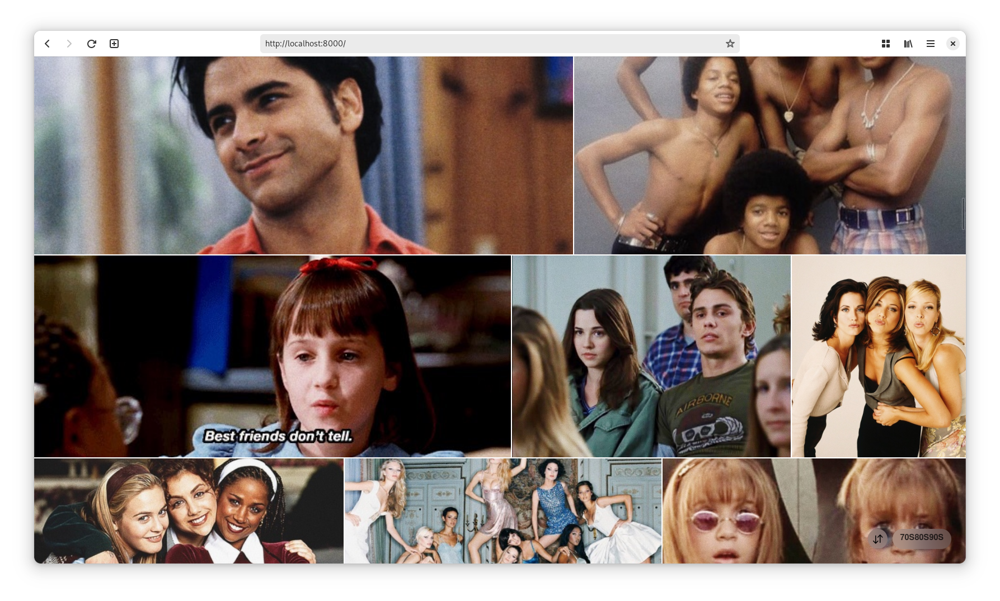

# river

A simple photostream web app that fetches photos from [VSCO]. Hugely inspired
and based on [photo-stream].



> Note: All images are courtesy of [70s80s90s on VSCO][copyright]

## Demo

To run a pre-configured demo of river, you can use the following command:

```sh
deno task demo
```

You can check the [demo] folder for more info.

### Setup

First, make sure Deno is installed:
https://deno.land/manual/getting_started/installation

Before running the project, you must create a `.env` file in the root directory.
This file should contain the configuration for the project. The default options
are set in `.env.defaults`; you should check that file to see all available
configuration options.

```ini
TITLE=My photostream
DESCRIPTION=A collection of my photos
# ...

# the user_id is the only required option
USER_ID=your-vsco-user-id
```

#### Getting your VSCO user ID

Using a user ID helps to avoid resolving the user ID from the username on each
request.

To get your numeric VSCO user ID, you can run the following command:

```sh
deno task get-id your-username
```

### Usage

To run the project, you can use the following command:

```sh
deno task start
```

This will watch the project directory and restart as you make changes.

### Contributing

river is available under the MIT license. Please take a look at the [LICENCE]
file for more info. Pull requests are welcome! If you have a feature request,
please open an issue.

For some ideas on what to work on, check out the [TODO] file.

[vsco]: https://vsco.co
[photo-stream]: https://github.com/waschinski/photo-stream
[licence]: ./LICENCE
[todo]: ./TODO
[demo]: ./demo
[copyright]: https://vsco.co/70s80s90s/gallery
